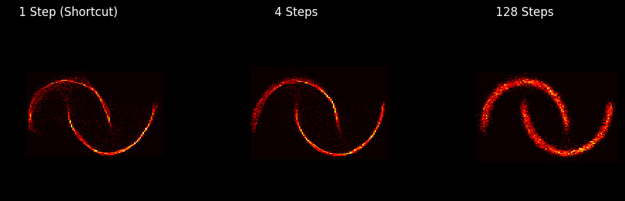

### Minimal Shortcut Models Pytorch implementation
A minimal unofficial implementation of the paper *One Step Diffusion via Shortcut Models* by Kevin Frans, Danijar Hafner, Sergey Levine and Pieter Abbeel.




### What shortcut models are
Shortcut models are a family of generative models designed to speed up inference in diffusion-style generation. Unlike standard diffusion or flow-matching models that require many iterative denoising steps, a shortcut model trains a single neural network that is conditioned not just on the current noise level but also on the desired step size. This allows the model to “skip ahead” in the generative process and produce high-quality outputs in one step or a few steps without complex multi-stage training.  
[arXiv link here]

### Why they’re interesting

- **Fast generation:** They can produce high-quality samples with significantly fewer forward passes (even one), reducing inference time by orders of magnitude.
- **Simple training:** They avoid the multi-stage distillation, careful scheduling that many previous accelerated methods require, and the Jacobian Vector Product which is required in concurrent works like MeanFlow.
- **Flexible inference budget:** The same trained model works across different computational budgets—one-step, few-step, or many-step generation.

## Setup

Install `uv` to manage your Python environment as follows:

```bash
# Install uv
curl -LsSf https://astral.sh/uv/install.sh | sh

# Setup all packages
uv sync
